# 小米R4A千兆版刷机教程
## 1.下载一键刷机包

点击此处下载

[蓝奏云](https://wwwv.lanzouw.com/icka50szlzoj)

[百度云](https://pan.baidu.com/s/15TrdfTNS6tw1LkJSUxuyDQ?pwd=nqag)

> 百度秒传
> ``` bash
> 7a0d7023222b274c9c2b46309bacd343#36884945#R4A最新开ssh工具.zip
> ```

## 2.开始刷机

- 1.连接路由器，进入后台。将路由器降级到[可刷机版本](./MIR4A_firmware_2.28.62/miwifi_r4a_firmware_72d65_2.28.62.bin)。
- 2.断开电脑的网络。(也可以不断开)。
- 3.进入R4A最新开ssh工具文件夹,双击 **1.V1版开Telnet.bat** 文件。
- 
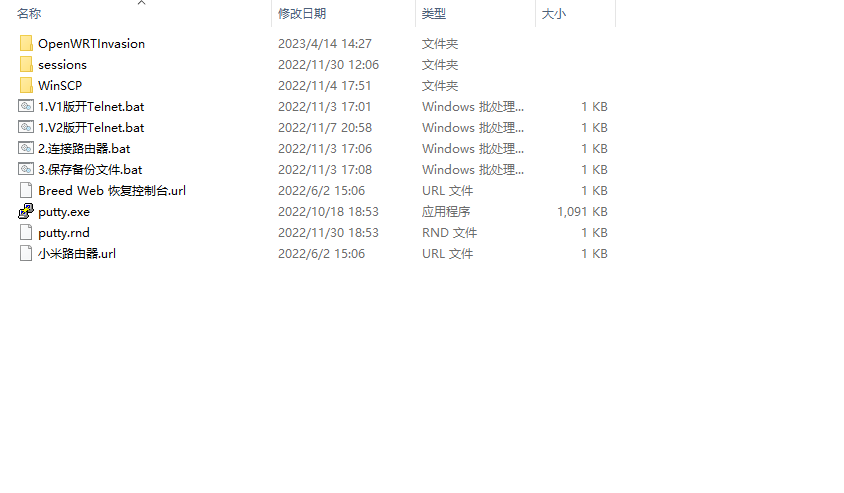

- 4.输入192.168.31.1

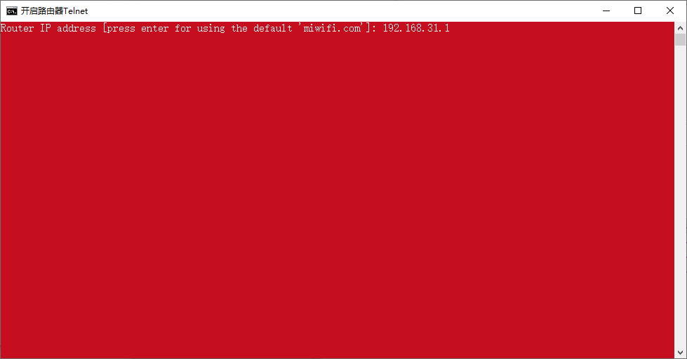
- 5.输入路由器密码

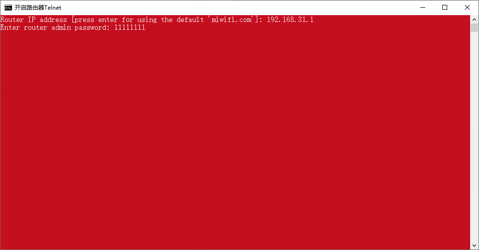
- 6.默认选1

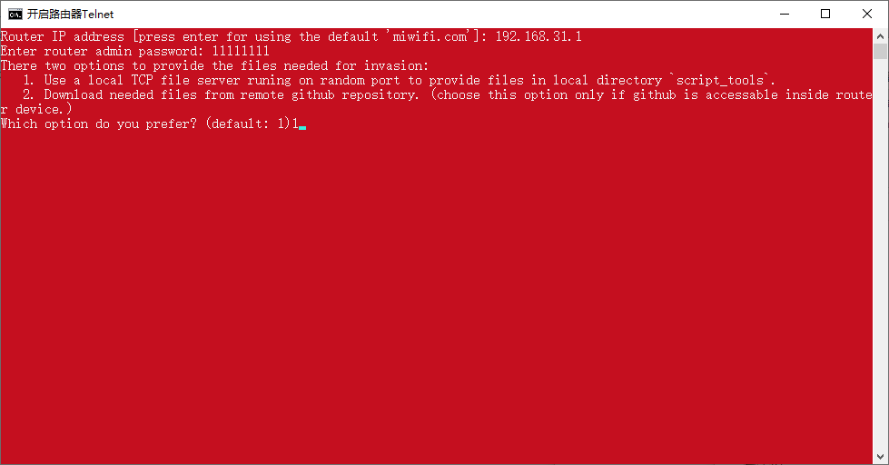
- 7.进入R4A最新开ssh工具文件夹,双击 **2.连接路由器.bat** 文件。


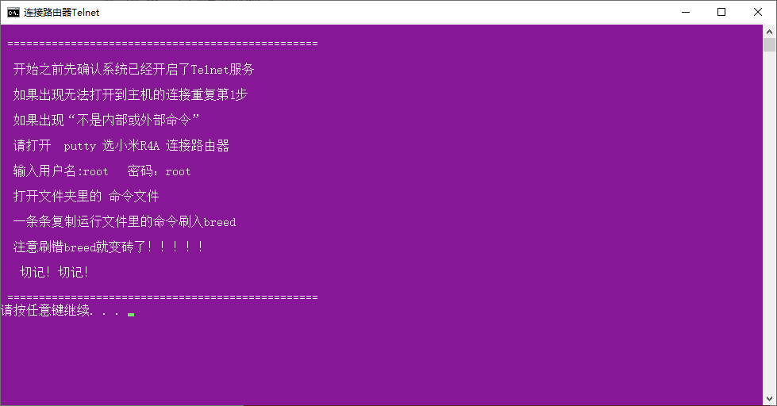
- 8.输入用户名和密码，都为**root**

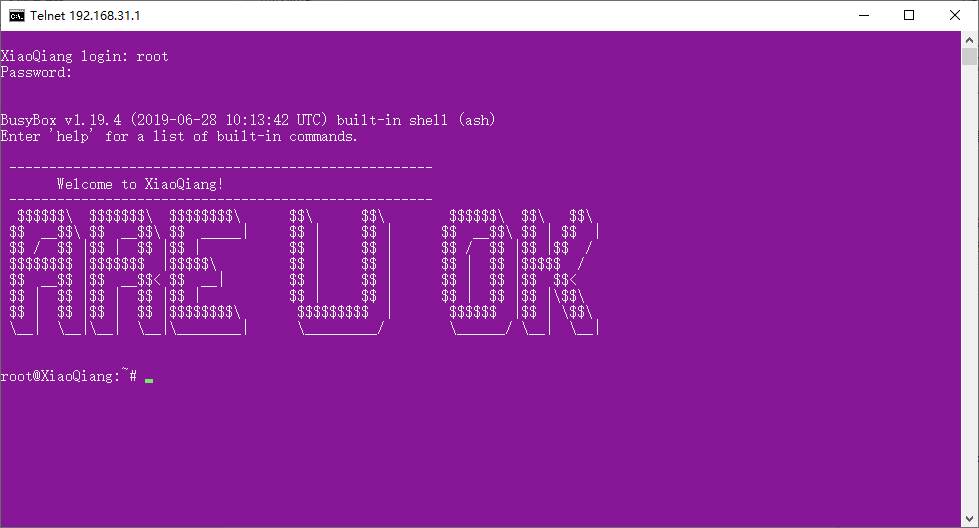
- 9.输入如下命令查看分区情况
  
 ```bash
 cat /proc/mtd
 ```
 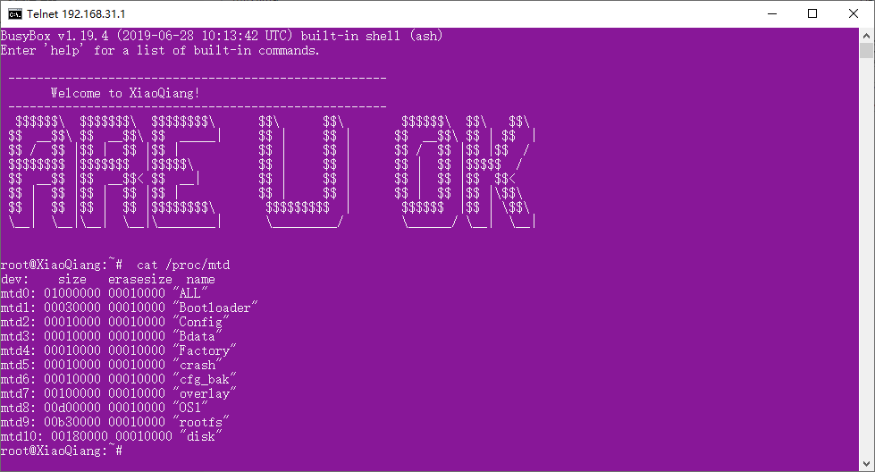
 - 10.输入如下命令备份文件

 ```bash
 dd if=/dev/mtd0 of=/tmp/all.bin
 dd if=/dev/mtd1 of=/tmp/bootloader.bin
 ```
 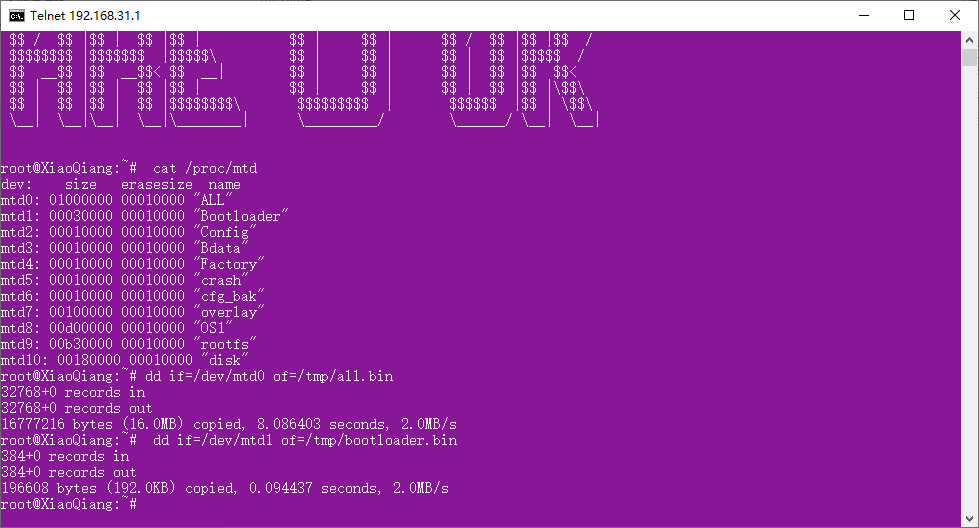
 - 11.进入R4A最新开ssh工具文件夹,双击 **3.保存备份文件.bat** 文件。


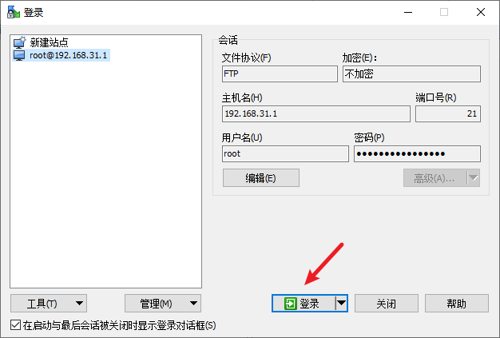
 - 12.将**all.bin**和**bootloader.bin**文件保存，并将**breed-mt7621-pbr-m1.bin**上传到**tmp**文件夹

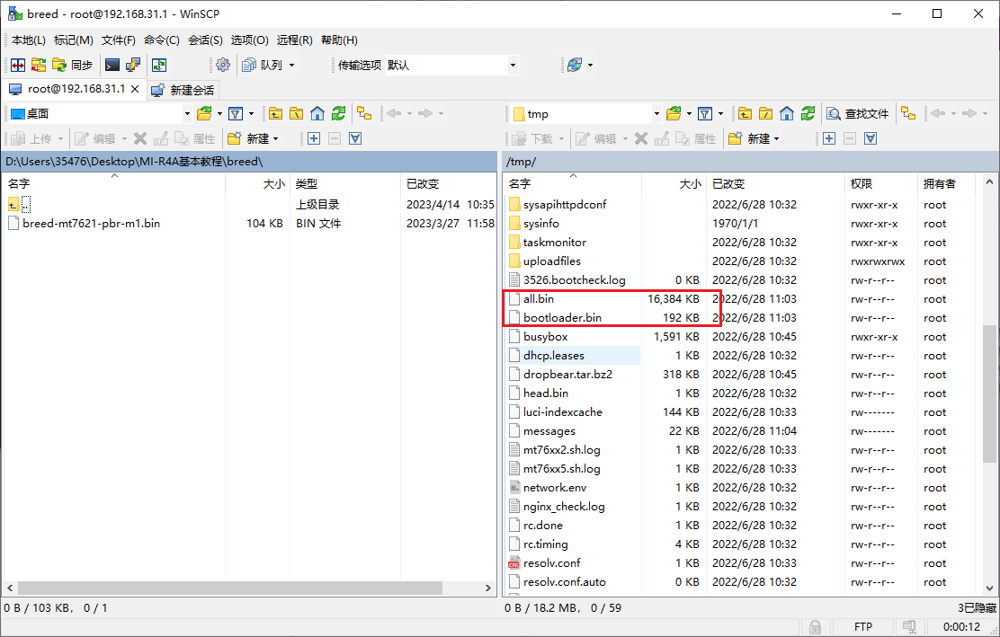
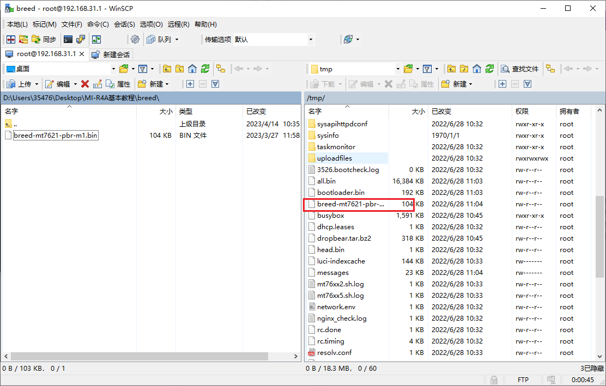
- 13.在Telnet命令面板输入如下命令

 ```bash
 mtd write /tmp/breed-mt7621-pbr-m1.bin Bootloader
 ```  
 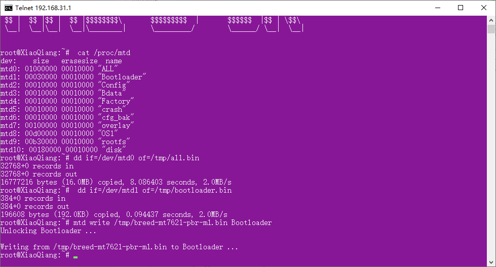
- 14.断电 按住复位键的同时插电，等待5-6s即可松开复位键，此时就进入了 Breed 模式。
- 15.在浏览器的地址栏输入 192.168.1.1 即可进入 Breed 界面。
  **（注意：由于运营商光猫管理界面一般为192.168.1.1 ，故须拔去 WAN 口网线，否则会访问到光猫管理界面。）**


- 16.点击固件备份，将eeprom(eeprom.bin)和编程器固件(full.bin)备份

 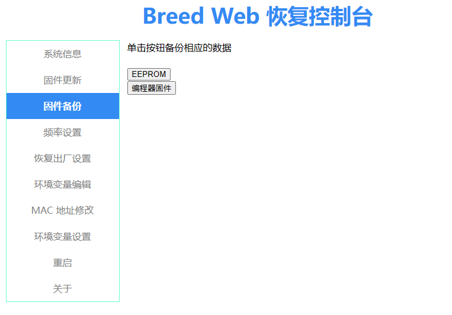
- 17.将mac地址修改界面截图备份

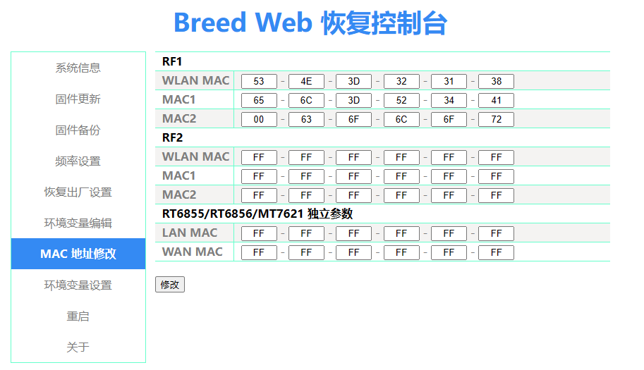
- 18.点击固件更新，将要刷入的固件和**eeprom.bin**刷入即可（第一次输入时需要刷入之前备份的**eeprom.bin**）

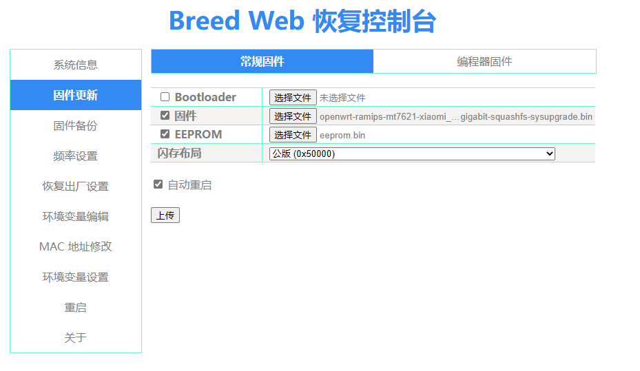
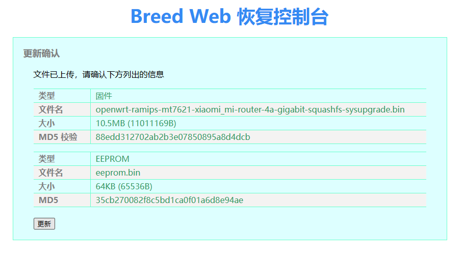
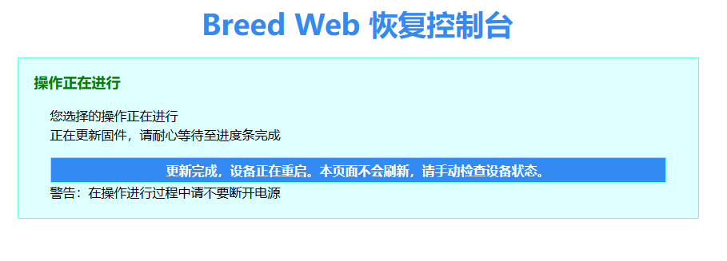
- 19.等待路由器重启即可。
  
## 3.刷机失败使用官方工具修复
点击此处下载

[蓝奏云](https://wwwv.lanzouw.com/io1mF0szwyqb)

[百度云](https://pan.baidu.com/s/1PysAYvUyfiCm_y0jnKJAnA?pwd=zz5w)

> 百度秒传
> ``` bash
> 881ff7f3b98bfb4278c0f1be0ba9d58c#953449#小米WIFI修复工具.zip
> ```

- 1.打开修复工具文件夹，双击**MIWIFIRepairTool.x86.exe**
  
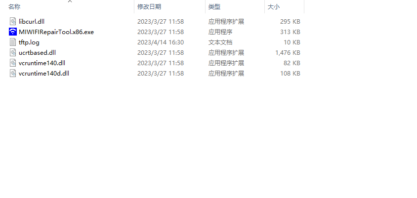

- 2.选择官方固件

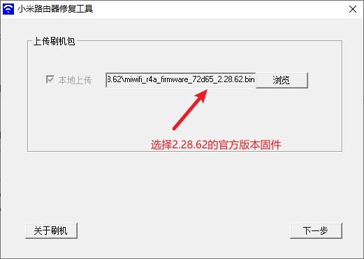
- 3.选择LAN口网卡（不确定就把其他的网卡先禁用）

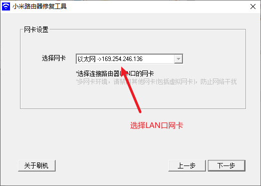
- 4.断电，按住复位键的同时插电，看到黄灯闪烁后即可松开复位键

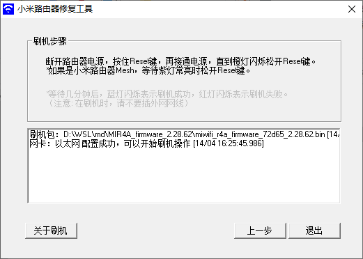
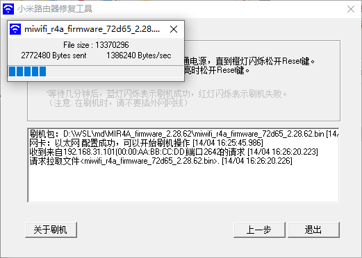
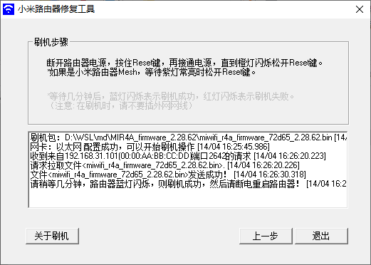
